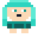
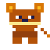
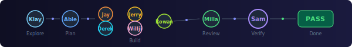

<p align="center">
  
</p>

<p align="center">
  <a href="#install">Install</a> · <a href="#team">Team</a> · <a href="#innovations">Innovations</a> · <a href="#commands">Commands</a> · <a href="#architecture">Architecture</a>
</p>

---

## Install

**Claude Code 세션에서**

```
/plugin marketplace add sangwookp9591/ai-ng-kit-claude
```

```
/plugin install aing
```

**터미널에서 한 줄로**

```
claude plugin marketplace add sangwookp9591/ai-ng-kit-claude && claude plugin install aing
```

**업데이트**

```
claude plugin update aing@aing-marketplace
```

> 버전은 `.claude-plugin/marketplace.json` + `.claude-plugin/plugin.json` + `package.json` 3곳의 매니페스트로 관리됩니다. `claude plugin update`는 이 매니페스트의 version 필드를 기준으로 업데이트를 판단합니다.

### 새 버전 릴리즈 방법 (메인테이너용)

```bash
# 1. 3곳 매니페스트 버전 동시 업데이트
sed -i '' 's/"version": "OLD"/"version": "NEW"/g' \
  package.json \
  .claude-plugin/marketplace.json \
  .claude-plugin/plugin.json

# 2. CHANGELOG.md에 변경 내역 추가

# 3. 커밋 + 태그 + 푸시
git add -A
git commit -m "chore: bump version to NEW across all manifests"
git tag vNEW
git push && git push origin vNEW
```

> **주의**: `package.json`만 올리고 매니페스트를 빠뜨리면 `claude plugin update`가 새 버전을 감지하지 못합니다. 3곳 모두 반드시 동일 버전으로 통일하세요.

---

<h2 id="team">Agent Team (14 named agents)</h2>

<table>
<tr>
<td width="50%" valign="top">

###  Leadership

| | Name | Role | Model |
|:---:|------|------|:-----:|
|  | **Sam** | CTO / Lead | `opus` |
|  | **Able** | PM / Planning | `sonnet` |
|  | **Klay** | Architect / Explorer | `opus` |

###  Design

| | Name | Role | Model |
|:---:|------|------|:-----:|
|  | **Willji** | UI/UX Designer | `sonnet` |

</td>
<td width="50%" valign="top">

###  Backend

| | Name | Role | Model |
|:---:|------|------|:-----:|
|  | **Jay** | API Development | `sonnet` |
|  | **Jerry** | DB / Infrastructure | `sonnet` |
|  | **Milla** | Security / Auth | `sonnet` |
| | **Jun** | Performance / Optimization | `sonnet` |
| | **Simon** | Code Intelligence / Dead Code | `sonnet` |

###  Frontend

| | Name | Role | Model |
|:---:|------|------|:-----:|
|  | **Derek** | Screen Build | `sonnet` |
|  | **Rowan** | Motion / Interaction | `sonnet` |

</td>
</tr>
<tr>
<td width="100%" colspan="2" valign="top">

###  Magic

| | Name | Role | Model |
|:---:|------|------|:-----:|
|  | **Iron** | Wizard -- guided magic for non-developers | `sonnet` |

</td>
</tr>
</table>

### Cost-Aware Team Presets

Teams are **auto-selected** based on task complexity analysis:

| Preset | Size | Est. Cost | When |
|--------|:----:|-----------|------|
| **Solo** | 1 | ~15K tok | Bug fix, single file |
| **Duo** | 2 | ~18K tok | Mid feature, API |
| **Squad** | 4 | ~48K tok | Fullstack, multi-domain |
| **Full** | 7 | ~123K tok | Architecture, security |

---

<h2 id="innovations">5 Innovations</h2>

| | Innovation | What it solves |
|:---:|-----------|---------------|
| 1 | **Context Budget** | Tracks ~token consumption per hook, trims by priority when over budget |
| 2 | **Cross-Session Learning** | Captures success patterns, reapplies in future sessions automatically |
| 3 | **Adaptive Routing** | Scores task complexity, routes to haiku / sonnet / opus dynamically |
| 4 | **Evidence Chain** | Collects test/build/lint proof -- no evidence, no "done" |
| 5 | **Self-Healing** | Health check + recovery engine + circuit breaker + git rollback |

### Harness 4-Axis Score

```
Constrain  ██████████████████████████████████████████████░░ 92
Inform     ████████████████████████████████████████████░░░░ 90
Verify     ████████████████████████████████████████████░░░░ 90
Correct    ████████████████████████████████████████████░░░░ 90
                                                     avg 90.5
```

| Axis | Modules |
|------|---------|
| **Constrain** | Guardrail Engine (7 rules), Safety Invariants (5 limits), Cost Ceiling, Dry-Run |
| **Inform** | Context Budget, Progress Tracker, Convention Extractor, Context Compaction |
| **Verify** | TDD Engine (RED-GREEN-REFACTOR), Evidence Chain, Agent Trace |
| **Correct** | Health Check, Recovery Engine, Circuit Breaker, Retry (exp. backoff), Rollback |

---

<h2 id="commands">Commands</h2>

### Workflow

| Command | What it does |
|---------|-------------|
| `/aing start <name>` | Start PDCA cycle (Plan stage) |
| `/aing auto <feat> <task>` | Full pipeline: Klay - Able - Jay/Derek - Milla - Sam |
| `/aing status` | Real-time dashboard (PDCA + TDD + Tasks + Budget) |
| `/aing next` | Advance to next PDCA stage |
| `/aing wizard` |  Iron -- guided magic for non-developers |

### TDD

| Command | What it does |
|---------|-------------|
| `/aing tdd start <feat> <target>` | Begin RED phase -- write failing test first |
| `/aing tdd check pass` | Record pass -- advance phase (RED-GREEN-REFACTOR) |
| `/aing tdd check fail` | Record fail -- stay in current phase with guidance |
| `/aing tdd status` | Show current TDD phase |

### Task Checklist

| Command | What it does |
|---------|-------------|
| `/aing task create <title>` | Create Main Task with Sub Tasks |
| `/aing task check <id> <seq>` | Mark subtask done |
| `/aing task list` | List all tasks with progress |

### Agent Direct

| Command | Agent | Role |
|---------|-------|------|
| `/aing explore <target>` |  Klay | Architecture + codebase scan |
| `/aing plan <task>` |  Able +  Klay | Requirements + architecture |
| `/aing execute <task>` |  Jay +  Derek | Backend + Frontend |
| `/aing review` |  Milla | Security + quality review |
| `/aing verify` |  Sam | Final review + evidence chain |

### Agent UI (3D Office)

| Command | What it does |
|---------|-------------|
| `/aing agent-ui` | Open 3D office in browser -- visualize current session |
| `/aing agent-ui --setup` | Auto-configure Claude Code hooks (one-time) |
| `/aing agent-ui --status` | Check current setup status |
| `/aing agent-ui --uninstall` | Remove hooks from settings |

> 🏢 [office.sw-world.site](https://office.sw-world.site) — 팀원 초대 코드로 실시간 협업 시각화

### Recovery

| Command | What it does |
|---------|-------------|
| `/aing rollback` | Revert to last git checkpoint (non-destructive) |
| `/aing learn show` | View cross-session learning history |
| `/aing help` | Show agent team and full command list |

---

## Quick Start

```
-- Start a PDCA cycle
/aing start user-auth

-- Or run the full pipeline automatically
/aing auto user-auth "JWT authentication with refresh tokens"

-- Non-developer? Just say what you want
/aing wizard
```

### Pipeline Flow

<p align="center">
  
</p>

```
/aing auto user-auth "JWT auth"

  1. Klay     -- scan codebase, extract conventions, design architecture
  2. Able     -- write requirements + spec + task checklist
  3. Jay      -- implement API (TDD: RED-GREEN-REFACTOR)
     Jerry    -- database schema + migration
     Milla    -- auth middleware + security
     Willji   -- login UI design
     Derek    -- frontend implementation
     Rowan    -- form interactions + animations
  4. Milla    -- security review (OWASP Top 10)
     Sam      -- final code review + evidence chain
  5. Sam      -- verdict:
                 [test] PASS (24/24)
                 [build] PASS
                 [lint] PASS (0 errors)
                 Verdict: PASS

  -> .aing/reports/ completion report
  -> Cross-Session Learning captured
```

---

## Multilingual

Korean and English auto-detected:

| Input | Action |
|-------|--------|
| "plan" / "plan this" | PDCA Plan stage |
| "verify" / "verify" | PDCA Check stage |
| "build me" / "build" | Iron wizard mode |
| "explore" / "explore" | Klay codebase scan |

---

<h2 id="architecture">Architecture</h2>

```
ai-ng-kit/
  .claude-plugin/plugin.json         -- plugin manifest
  hooks/hooks.json                   -- 7 hook events
  hooks-handlers/                    -- session-start, user-prompt, pre/post-tool, compact, stop
  scripts/
    core/         state, config, logger, context-budget, display, dashboard, stdin
    guardrail/    guardrail-engine, safety-invariants, cost-ceiling, dry-run,
                  progress-tracker, convention-extractor
    pdca/         pdca-engine (5-Stage: plan-do-check-act-review)
    tdd/          tdd-engine (RED-GREEN-REFACTOR)
    routing/      complexity-scorer, model-router, routing-history
    memory/       project-memory, learning-capture
    evidence/     evidence-collector, evidence-chain, evidence-report
    recovery/     health-check, recovery-engine, circuit-breaker, retry-engine
    trace/        agent-trace
    compaction/   context-compaction (priority-based preservation)
    pipeline/     agent-pipeline, team-orchestrator, auto-runner, rollback, handoff
    task/         task-manager, plan-manager
    cli/          persist (plan/task/report persistence CLI)
    i18n/         intent-detector, locale
  agents/         10 named agents (sam, able, klay, jay, jerry, milla, willji, derek, rowan, iron)
  commands/       aing.md, help.md
  skills/         12 skill definitions (including agent-ui)
  templates/      plan, review, completion, adr
  images/         12 custom SVG icons
```

### Runtime Data (`.aing/`, gitignored)

```
.aing/
  state/          PDCA status, TDD phase, invariants, pipeline, circuit-breaker
  tasks/          Main Task -> Sub Task checklists
  plans/          Plan documents
  snapshots/      Compaction snapshots (max 10)
  reports/        Completion reports
  handoffs/       Stage transition context
  logs/           Structured JSONL logs
```

---

## Performance

| Metric | Result |
|--------|--------|
| Hook response | **5ms** (budget: 5,000ms) |
| Config cold start | **36ms** |
| Test suite | **76/76 ALL GREEN** |
| External dependencies | **0** |
| Harness maturity | **Level 5 / 5** |

## Requirements

- Claude Code v2.1.69+
- Node.js v18+

## License

Apache-2.0

---

<p align="center">
  <sub>Built by <a href="https://github.com/sangwookp9591">SW</a></sub>
</p>
